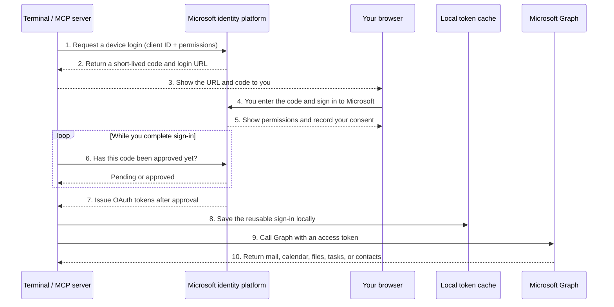
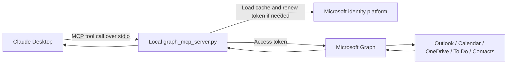

# Connecting Claude Desktop to a personal Outlook or Hotmail account


*Figure 1: How Claude Desktop connects to a personal Outlook or Hotmail account through a local MCP server and Microsoft Graph.*


Claude Desktop can connect to Microsoft 365, but the built-in Microsoft connector is intended for work and school accounts. If you try to sign in with a personal address such as `@hotmail.com`, `@outlook.com`, or `@live.com`, the authentication is rejected.

That does not mean Microsoft Graph cannot access a personal Microsoft account. It can. The restriction comes from the way Anthropic's connector application is registered.

The practical workaround is to register your own Microsoft application, allow personal Microsoft accounts, and connect it to a small local MCP server. Claude Desktop can then search your mail, create drafts, work with your calendar, and read files from OneDrive.

This guide walks through the complete setup on macOS.

## What this setup can do

| Capability                                            | Available?     |
| ----------------------------------------------------- | -------------- |
| Read and search mail                                  | Yes            |
| Create drafts and draft replies                       | Yes            |
| Send mail                                             | No             |
| Navigate mail folders and move messages between them  | Yes            |
| Flag, categorize, and mark mail read or unread        | Yes            |
| Create inbox rules that move mail into a folder       | Yes            |
| Read and create calendar events                       | Yes            |
| Search and read OneDrive files                        | Yes, read only |
| Manage Microsoft To Do tasks                          | Yes            |
| Search and create contacts                            | Yes            |
| Delete anything (mail, calendar, folders, files, ...) | No             |

The server does not request the `Mail.Send` permission. Claude can prepare a draft, but you must review and send it yourself from Outlook.

The server also never deletes anything. No tool issues a delete against a message, event, folder, task, contact, or Drive item, and no tool moves anything to Deleted Items. One tool's name sounds like it might: `delete_mail_rule` removes an inbox-rule automation, not any email.

This is intentional. It gives Claude access to the parts that are useful for research, organizing, and drafting, without allowing it to send messages from your account or remove anything from it.

## What you are setting up

The setup has three parts:

1. A Microsoft Entra application registration that allows personal Microsoft accounts.
2. A local Python MCP server that communicates with Microsoft Graph.
3. A Claude Desktop configuration entry that launches the server.

You only need to sign in manually once. After that, the Microsoft authentication library uses the cached token to renew access in the background.

---

# Part A: Register the application in Microsoft Entra

This does not require a paid Azure subscription.

## A1. Open App registrations

Go to **entra.microsoft.com**.

In the left navigation, expand **Entra ID**, then select **App registrations**.

You can also open the page directly:

```text
https://entra.microsoft.com/#view/Microsoft_AAD_RegisteredApps/ApplicationsListBlade
```

## A2. Create a new registration

Select **New registration** and enter the following:

* **Name:** `claude-graph-mcp`
* **Supported account types:** Accounts in any organisational directory and personal Microsoft accounts
* **Redirect URI:** Leave this blank

The account type is the important part. It must include personal Microsoft accounts. Otherwise, a Hotmail, Outlook.com, or Live.com account will still be rejected.


## A3. Copy the client ID

After creating the registration, Microsoft opens the application's overview page.

Copy the **Application (client) ID**. You will use it during the first sign-in and again in the Claude Desktop configuration.

Also check the **Supported account types** value. It should say:

```text
All Microsoft account users
```

If it shows a different value, it is easier to recreate the registration with the correct account type.


You may see a warning about consent for newly registered multitenant applications without a verified publisher. This usually applies to users consenting inside managed Entra tenants. If Microsoft shows a consent error later, keep the exact wording of the error before changing the configuration.

## A4. Enable public client flows

In the left menu:

1. Select **Authentication**.
2. Open the **Settings** tab.
3. Set **Allow public client flows** to **Enabled**.
4. Select **Save**.

The device-code sign-in used later depends on this setting. Make sure you press **Save**, as changing the toggle by itself does not commit the setting.


## A5. Add Microsoft Graph permissions

Go to:

**API permissions** → **Add a permission** → **Microsoft Graph** → **Delegated permissions**


Add the following permissions:

```text
User.Read
Mail.ReadWrite
Calendars.ReadWrite
Files.Read.All
MailboxSettings.ReadWrite
Tasks.ReadWrite
Contacts.ReadWrite
offline_access
```

What they are used for:

| Permission                  | Purpose                                                                         |
| --------------------------- | ------------------------------------------------------------------------------- |
| `User.Read`                 | Identify the signed-in Microsoft account                                        |
| `Mail.ReadWrite`            | Read mail, create drafts, and organize mail (move, flag, categorize, mark read) |
| `Calendars.ReadWrite`       | Read and create calendar events                                                 |
| `Files.Read.All`            | Read files from OneDrive                                                        |
| `MailboxSettings.ReadWrite` | Create and manage inbox rules                                                   |
| `Tasks.ReadWrite`           | Read and create Microsoft To Do tasks                                           |
| `Contacts.ReadWrite`        | Search and create contacts                                                      |
| `offline_access`            | Renew access without asking you to sign in each time                            |

`User.Read` is often added automatically.

The `offline_access` permission may appear under an OpenID-related group rather than beside the other resource permissions. Searching for it by name is usually easier.

Do not add `Mail.Send`.

> No delete-capable permission is requested either. `Files.Read.All` is used instead of `Files.ReadWrite.All`, which would allow deleting Drive items, and none of the other permissions above grant delete rights. Nothing in this setup can delete a message, event, folder, task, contact, or Drive item.

## A6. Check the final permission list

The final list should contain eight delegated Microsoft Graph permissions and should not contain `Mail.Send`.


You do not need to use **Grant admin consent** for this personal-account setup. The relevant consent happens when you sign in with the personal Microsoft account in Part C.

---

# Part B: Install the MCP server locally

Save `graph_mcp_server.py` in your Downloads folder, then run:

```bash
mkdir -p ~/msgraph-mcp
mv ~/Downloads/graph_mcp_server.py ~/msgraph-mcp/
cd ~/msgraph-mcp
python3 -m venv .venv
source .venv/bin/activate
pip install "mcp[cli]" msal httpx
```

This creates a folder called `msgraph-mcp`, moves the server into it, creates a Python virtual environment, and installs the required packages.

Your project folder should look similar to this:


The images folder shown in the screenshot belongs to this guide. The MCP server itself only needs the Python file and its virtual environment.

---

# Part C: Sign in to the personal Microsoft account

Claude Desktop cannot display the device-code prompt from the MCP server in a useful way, so the first sign-in should be completed manually in Terminal.

From the `msgraph-mcp` folder, run:

```bash
export MSGRAPH_CLIENT_ID="<your client ID from A3>"
python graph_mcp_server.py login
```

The script prints a code and asks you to open:

```text
https://microsoft.com/devicelogin
```

Enter the code and sign in with the personal Microsoft account whose mailbox you want Claude to access.

This may be different from the Microsoft account you used while creating the Entra application. The account used for the Entra portal owns the application registration. The account used during this login is the mailbox, calendar, and OneDrive account that the MCP server will access.

Approve the requested permissions.

When the terminal shows a message similar to this, the sign-in is complete:

```text
Authenticated. Token cached at …
```

The script exits by itself. You do not need to press `Ctrl-C`.

The token cache is stored here:

```text
~/.msgraph-mcp/token_cache.json
```

Later requests use the cached sign-in and normally do not open the browser again.

## Why the `login` command is needed

Running this command:

```bash
python graph_mcp_server.py
```

starts the MCP server and waits for JSON-RPC requests through standard input. It does not immediately perform authentication.

The `login` subcommand calls the authentication path directly, displays the device code, saves the token cache, and exits. This makes the first sign-in much easier to complete and troubleshoot.

## What happens during login

The login uses OAuth 2.0 **device authorization flow**. This flow is designed for an application that cannot conveniently open a browser or receive a browser redirect. The MCP server never asks for, sees, or stores your Microsoft password.



Here is what each piece means:

* **The login link** points to a Microsoft-owned page. It is a general device-login page, not a page hosted by this project. Always check that the hostname belongs to Microsoft before entering credentials.
* **The displayed code** temporarily connects the browser session to the login request waiting in the terminal. It is not your password, client ID, access token, or MFA code. It expires after a short time and is useful only for that pending login.
* **The client ID** identifies the Entra application you registered. It tells Microsoft which application is requesting access and which registration settings apply. A client ID is a public identifier, not a secret.
* **Your Microsoft sign-in and MFA** happen entirely on Microsoft's website. Microsoft tells the local server only whether authorization is still pending, was declined, expired, or succeeded.
* **The permissions (scopes)** describe what the application is asking to do, such as reading and organizing mail. The consent screen is where you approve those permissions. The code deliberately does not request `Mail.Send`.
* **The polling** is why the terminal appears to wait after printing the code. The server periodically asks Microsoft whether you have finished signing in. No browser callback to your computer is required.
* **The access token** is a short-lived credential that the server attaches to Microsoft Graph requests. Graph checks the token before returning account data.
* **The cached sign-in** is stored in `~/.msgraph-mcp/token_cache.json`. It lets MSAL obtain fresh access tokens later without showing the device-login page every time. Treat this file as sensitive: anyone who can use it may be able to act with the permissions you approved.

The code and the tokens serve different purposes:

| Item | What it proves or identifies | Lifetime | Secret? |
| --- | --- | --- | --- |
| Client ID | Which registered application is asking | Long-lived | No |
| Device code | Which pending terminal login you are approving | Short-lived, one login | Treat as temporary-sensitive |
| Microsoft password/MFA | That you control the Microsoft account | Used only by Microsoft during sign-in | Yes; never seen by this server |
| Access token | That the app currently has approved Graph access | Short-lived | Yes |
| Cached authentication state | Lets MSAL renew access without another interactive login | Until expired, revoked, or removed | Yes |

After the first successful login, a normal tool call follows the shorter path below:



You will see the link and code again only when silent authentication cannot continue—for example, if the cache was removed, consent was revoked, the account requires a fresh sign-in, or the requested permissions changed. Run `python graph_mcp_server.py login` in a visible terminal in that situation; do not try to complete an interactive login through Claude's hidden MCP process.

---

# Part D: Add the server to Claude Desktop

Claude Desktop stores its local MCP server configuration in:

```text
~/Library/Application Support/Claude/claude_desktop_config.json
```

Open the file in TextEdit:

```bash
open -e ~/Library/Application\ Support/Claude/claude_desktop_config.json
```

If Terminal reports that the folder or file does not exist, create it first:

```bash
mkdir -p ~/Library/Application\ Support/Claude
touch ~/Library/Application\ Support/Claude/claude_desktop_config.json
open -e ~/Library/Application\ Support/Claude/claude_desktop_config.json
```

## If the file is empty

Paste the following configuration.

Replace `YOUR_USERNAME` with your macOS username, and replace the client ID with the value copied in Part A.

```json
{
  "mcpServers": {
    "microsoft-graph": {
      "command": "/Users/YOUR_USERNAME/msgraph-mcp/.venv/bin/python",
      "args": [
        "/Users/YOUR_USERNAME/msgraph-mcp/graph_mcp_server.py"
      ],
      "env": {
        "MSGRAPH_CLIENT_ID": "<your client ID from A3>"
      }
    }
  }
}
```

## If the file already contains other MCP servers

Do not replace the existing contents. Add `microsoft-graph` inside the existing `mcpServers` object.

For example:

```json
{
  "mcpServers": {
    "existing-server": {
      "command": "/path/to/existing/server"
    },
    "microsoft-graph": {
      "command": "/Users/YOUR_USERNAME/msgraph-mcp/.venv/bin/python",
      "args": [
        "/Users/YOUR_USERNAME/msgraph-mcp/graph_mcp_server.py"
      ],
      "env": {
        "MSGRAPH_CLIENT_ID": "<your client ID from A3>"
      }
    }
  }
}
```

Make sure there is a comma between the existing server entry and the new `microsoft-graph` entry.

Use absolute paths. Claude Desktop does not reliably expand `~`, and it does not use the same shell environment as Terminal.

After saving the file:

1. Quit Claude Desktop completely with **Cmd-Q**.
2. Open Claude Desktop again.
3. Start a new chat.

Closing only the Claude window is not enough. Claude Desktop must restart before it reloads the MCP server configuration.


Open the Claude Desktop configuration file:

```bash
mkdir -p ~/Library/Application\ Support/Claude
open -e ~/Library/Application\ Support/Claude/claude_desktop_config.json
```

Add the following configuration.

Replace `YOUR_USERNAME` with your macOS username, and replace the client ID with the value copied in Part A.

```json
{
  "mcpServers": {
    "microsoft-graph": {
      "command": "/Users/YOUR_USERNAME/msgraph-mcp/.venv/bin/python",
      "args": [
        "/Users/YOUR_USERNAME/msgraph-mcp/graph_mcp_server.py"
      ],
      "env": {
        "MSGRAPH_CLIENT_ID": "<your client ID from A3>"
      }
    }
  }
}
```

Use absolute paths. Claude Desktop does not reliably expand `~`, and it does not use your normal shell environment in the same way Terminal does.

After saving the file:

1. Quit Claude Desktop completely with **Cmd-Q**.
2. Open Claude Desktop again.
3. Start a new chat.

Closing only the Claude window is not enough because the application must restart before it reloads the MCP server configuration.

---

# Part E: Test the connection

In a new Claude Desktop chat, enter:

```text
Use whoami to check which Microsoft account is connected
```

Claude should call the `whoami` MCP tool and return the personal Microsoft account you used in Part C.

After that, test the mailbox connection with a simple request such as:

```text
Search my mailbox for recent emails from Microsoft
```

This checks the complete path:

```text
Claude Desktop
    → local MCP server
    → cached Microsoft sign-in
    → Microsoft Graph
    → your personal mailbox
```

## Changing scopes later

This guide's permission list has grown over time (see Part A5). If you set up the server before folder navigation, mail rules, To Do, or Contacts were added, your cached token was issued for the old, shorter scope list.

This is exactly the scenario covered in [You changed the requested permissions](#you-changed-the-requested-permissions): delete the token cache and sign in again before the new tools will work.

```bash
rm ~/.msgraph-mcp/token_cache.json
export MSGRAPH_CLIENT_ID="<your client ID from A3>"
python graph_mcp_server.py login
```

Approve the new permissions when prompted. Until you do this, tools such as `create_mail_rule` or `list_task_lists` will fail with a permissions error even though `search_mail` keeps working.

## Tools available to Claude

| Tool                      | What it does                                                               |
| ------------------------- | -------------------------------------------------------------------------- |
| `whoami`                  | Shows which Microsoft account is connected                                 |
| `search_mail`             | Searches across the mailbox                                                |
| `list_recent_mail`        | Lists recent messages from folders such as inbox, sent items, or drafts    |
| `read_message`            | Reads the full body of a message                                           |
| `create_draft`            | Creates an email draft                                                     |
| `reply_draft`             | Creates a draft reply to an existing message                               |
| `list_mail_folders`       | Returns the mail folder tree from a given folder (or the top level)        |
| `resolve_folder_path`     | Resolves a folder path like `Inbox/Bank/CIBC_Canada` to a folder id        |
| `list_messages_in_folder` | Lists recent messages in a folder found by path                            |
| `create_mail_folder`      | Creates a mail folder at a given path (or returns it if it already exists) |
| `move_message`            | Moves a message to another folder                                          |
| `flag_message`            | Sets or clears the follow-up flag on a message                             |
| `categorize_message`      | Sets the category labels on a message                                      |
| `mark_message_read`       | Marks a message read or unread                                             |
| `list_mail_rules`         | Lists the inbox rules configured on the mailbox                            |
| `create_mail_rule`        | Creates an inbox rule that moves matching mail into a folder               |
| `delete_mail_rule`        | Deletes an inbox rule (the automation, not any email)                      |
| `list_events`             | Lists calendar events within a date range                                  |
| `create_event`            | Creates a calendar event                                                   |
| `search_onedrive`         | Searches OneDrive files                                                    |
| `list_onedrive_folder`    | Lists the contents of a OneDrive folder                                    |
| `read_onedrive_file`      | Reads the contents of a text-based OneDrive file                           |
| `list_task_lists`         | Lists Microsoft To Do task lists                                           |
| `list_tasks`              | Lists tasks in a To Do list                                                |
| `create_task`             | Creates a task in a To Do list                                             |
| `complete_task`           | Marks a task completed (does not delete it)                                |
| `search_contacts`         | Searches contacts by name or email address                                 |
| `create_contact`          | Creates a contact                                                          |

The exact behaviour depends on how these tools are implemented in `graph_mcp_server.py`, but the Microsoft permissions granted in Part A place the upper limit on what the server can access. No tool here sends mail or deletes a message, event, folder, task, contact, or Drive item.

---

# How the connection works

You do not need to understand this section to complete the setup, but it helps when troubleshooting.

## The Entra application

The Entra application gives the local server an identity when it connects to Microsoft Graph.

It is configured as a public client because the code runs on your own computer. A desktop script cannot safely hide a client secret, so this setup uses a client ID and device-code authentication instead.

The delegated permissions define what the application may do while acting on behalf of the signed-in user.

## MSAL and the token cache

The server uses Microsoft's authentication library, MSAL.

During the first sign-in, Microsoft issues authentication tokens. MSAL stores the reusable account and token information in:

```text
~/.msgraph-mcp/token_cache.json
```

Before each Microsoft Graph request, the server asks MSAL for a valid access token. When possible, MSAL renews it silently using the cached authentication state.

You may need to sign in again if the cached token is deleted, revoked, or no longer valid.

## The MCP server

`graph_mcp_server.py` is a FastMCP application that communicates with Claude Desktop over standard input and standard output.

Claude Desktop launches the script as a local subprocess. When Claude decides to use a tool such as `search_mail`, it sends a JSON-RPC request to the server. The corresponding Python function runs, obtains a Microsoft access token, calls Microsoft Graph, and returns a smaller result to Claude.

A typical request follows this path:

```text
Claude Desktop
    ↕ stdio JSON-RPC
graph_mcp_server.py
    ↕ MSAL authentication
Microsoft Graph API
    ↕
Outlook, Calendar, or OneDrive data
```

Claude Desktop does not connect directly to Microsoft Graph. Microsoft Graph does not connect directly to Anthropic. The local MCP server sits between them and handles the translation.

---

# Troubleshooting

## Claude Desktop log files on macOS

Claude Desktop normally writes MCP diagnostics under:

```text
~/Library/Logs/Claude/
```

The most useful files for this server are:

| Log file | What it contains | Use it when |
| --- | --- | --- |
| `mcp-server-microsoft-graph.log` | Launch command, MCP requests and responses, server stderr, Microsoft login prompts, Graph request status, shutdowns, and timeouts for this server | Diagnosing almost any `microsoft-graph` failure |
| `mcp.log` | Combined lifecycle messages for all configured MCP servers | Checking whether Claude discovered and started the server |
| `main.log` | General Claude Desktop application events and configuration errors | Claude does not load the MCP configuration at all |

List the available Claude logs:

```bash
ls -la ~/Library/Logs/Claude
```

Read the latest entries for this server:

```bash
tail -n 100 ~/Library/Logs/Claude/mcp-server-microsoft-graph.log
```

Search for the most useful events without printing the entire log:

```bash
rg -n "Initializing|Server started|tools/call|To sign in|HTTP Request|error|cancelled|Shutting down" \
  ~/Library/Logs/Claude/mcp-server-microsoft-graph.log
```

Follow new entries while reproducing a problem in Claude:

```bash
tail -f ~/Library/Logs/Claude/mcp-server-microsoft-graph.log
```

Press `Ctrl-C` when finished following the log. The server writes diagnostics to stderr because stdout is reserved for MCP JSON-RPC messages. Claude captures that stderr output in the server-specific log.

Do not post a complete log publicly without reviewing it. Logs can contain local filesystem paths, account details, email metadata, errors returned by Microsoft Graph, and short-lived device-login codes. The token cache itself is stored separately and must never be shared:

```text
~/.msgraph-mcp/token_cache.json
```

## A quick troubleshooting workflow

1. Confirm that both configured paths exist and are absolute:

   ```bash
   ls -l /absolute/path/to/msgraph-mcp/.venv/bin/python
   ls -l /absolute/path/to/msgraph-mcp/graph_mcp_server.py
   ```

2. Check that the Claude configuration is valid JSON:

   ```bash
   python3 -m json.tool \
     ~/Library/Application\ Support/Claude/claude_desktop_config.json >/dev/null \
     && echo "Claude configuration is valid JSON"
   ```

3. Inspect `mcp-server-microsoft-graph.log`. A healthy startup contains `Server started and connected successfully`, followed by `initialize` and `tools/list` messages.

4. If a tool reports that Microsoft authentication is required, run the explicit login command in a visible terminal:

   ```bash
   export MSGRAPH_CLIENT_ID="<your client ID>"
   /absolute/path/to/msgraph-mcp/.venv/bin/python \
     /absolute/path/to/msgraph-mcp/graph_mcp_server.py login
   ```

5. Fully quit Claude Desktop with **Cmd-Q**, reopen it, start a new chat, and ask:

   ```text
   Use microsoft-graph whoami to check which Microsoft account is connected
   ```

Normal MCP tool calls never start an interactive device login. If cached authentication is unavailable, they return an immediate error telling you to run the visible `login` command. This prevents Claude from appearing frozen while an unseen device flow waits in the background.

## Common log signatures

| Log message or behaviour | Meaning | Action |
| --- | --- | --- |
| `ENOENT`, `spawn ... failed`, or a configured path does not exist | Claude is using a stale Python or server path | Update `command` and `args` to absolute, existing paths, then restart Claude |
| `MSGRAPH_CLIENT_ID is not set` | The `env` block is missing the application client ID | Add `MSGRAPH_CLIENT_ID` to this server's Claude configuration |
| `Microsoft authentication is required` | No usable cached token is available | Run the explicit `login` command, then retry |
| `To sign in ... enter the code ...` during an explicit `login` command | The device flow is correctly waiting for browser approval | Open the Microsoft URL and enter the short-lived code |
| HTTP `401 Unauthorized` | The token is expired, revoked, invalid, or for the wrong registration | Run the explicit login again; remove the cache first if necessary |
| HTTP `403 Forbidden` | The signed-in account or application lacks the requested permission | Check delegated Graph permissions and re-consent after changing scopes |
| A tool returns immediately on retry after an earlier timeout | A newly started process loaded authentication that the older process did not have | With the current server code this should be avoided by cache reload and fail-fast authentication; restart Claude if it is still running older code |
| `Server started and connected successfully`, but no `tools/call` appears | Claude launched the server but did not invoke the requested tool | Explicitly name `microsoft-graph` and the tool, such as `whoami`, in the prompt |

## The device-code flow does not start

Check **Allow public client flows** in the Entra application's Authentication settings.

Make sure it is set to **Enabled** and that you selected **Save** after changing it.

## `whoami` shows the wrong account

The wrong Microsoft account was used during Part C.

Delete the token cache:

```bash
rm ~/.msgraph-mcp/token_cache.json
```

Then run the login command again:

```bash
export MSGRAPH_CLIENT_ID="<your client ID>"
python graph_mcp_server.py login
```

This time, sign in with the personal Microsoft account whose mailbox you want to access.

## The MCP server does not appear in Claude Desktop

Check the following:

* The Python path in `claude_desktop_config.json` is absolute.
* The path to `graph_mcp_server.py` is absolute.
* The virtual environment exists.
* The JSON is valid.
* Claude Desktop was fully quit with **Cmd-Q** before reopening.

You can also test the Python path directly in Terminal:

```bash
/Users/YOUR_USERNAME/msgraph-mcp/.venv/bin/python \
/Users/YOUR_USERNAME/msgraph-mcp/graph_mcp_server.py
```

If the server starts and waits without printing an error, the paths are probably correct. Press `Ctrl-C` to stop the manual test.

## You changed the requested permissions

Delete the cached token and sign in again.

```bash
rm ~/.msgraph-mcp/token_cache.json
```

A previously cached token may not include permissions added later.

## Microsoft shows a consent error

Record the exact error message and check:

* The application supports personal Microsoft accounts.
* Public client flows are enabled.
* The correct client ID is being used.
* The login is being completed with the intended personal account.
* The requested permissions match the list in Part A.

Do not start changing several settings at once. The wording of the Microsoft error usually points to the specific registration or consent problem.

## A guide suggests an app password or basic IMAP authentication

That is not the approach used here.

This setup uses OAuth through Microsoft Graph. It does not store an Outlook password, and it does not rely on basic authentication against `imap-mail.outlook.com`.

---

# Security notes

The token cache gives the local MCP server access to the permissions you approved. Treat it as sensitive.

The file is stored here:

```text
~/.msgraph-mcp/token_cache.json
```

Do not upload it to GitHub, attach it to support tickets, or copy it to a shared folder.

It is also a good idea to add the following entries to your project's `.gitignore` file:

```gitignore
.venv/
token_cache.json
__pycache__/
*.pyc
```

If you no longer want the server to access the account, delete the token cache and remove the application's consent from your Microsoft account security settings.

You can also remove the MCP server entry from:

```text
~/Library/Application Support/Claude/claude_desktop_config.json
```

---

# Summary

The built-in Microsoft 365 connection in Claude Desktop does not accept personal Outlook, Hotmail, or Live.com accounts. Registering your own Microsoft application removes that account-type limitation.

Once the application is registered and the local MCP server is connected, Claude Desktop can work with your personal mailbox, calendar, and OneDrive through Microsoft Graph.

The setup requires a few manual steps, but most of them are completed only once:

1. Register the Entra application.
2. Add the delegated permissions.
3. Enable public client flows.
4. Install the local Python server.
5. Complete the first device-code sign-in.
6. Add the server to Claude Desktop.
7. Restart Claude and test it with `whoami`.

After that, the cached Microsoft sign-in is reused automatically during normal use.
