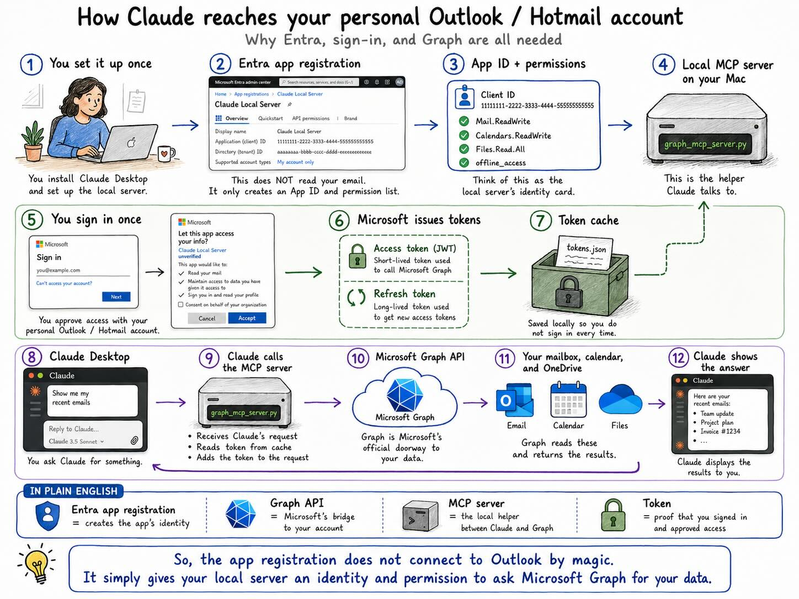
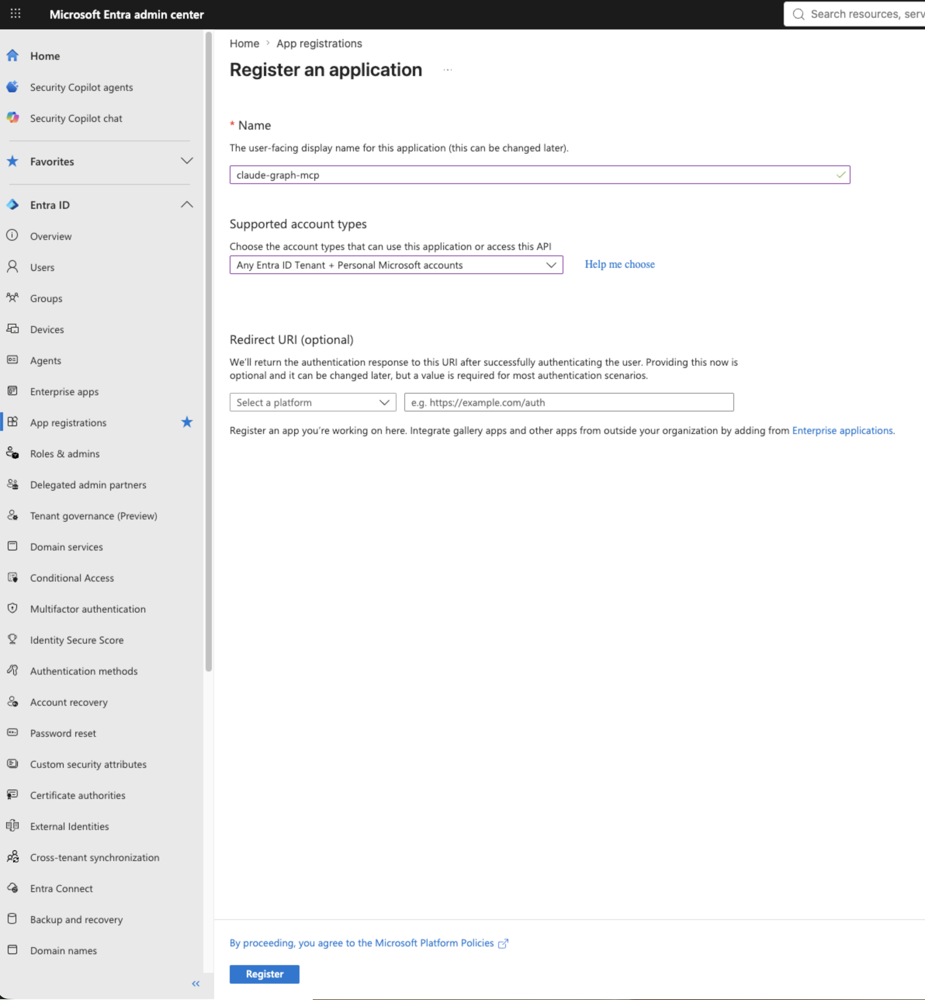
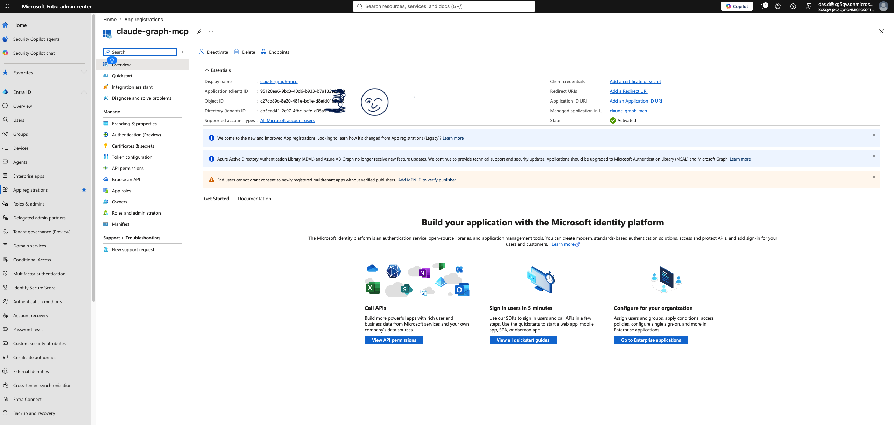
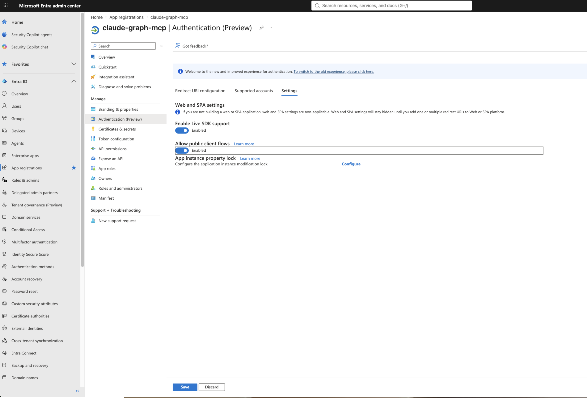
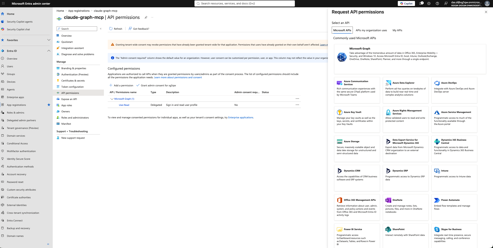
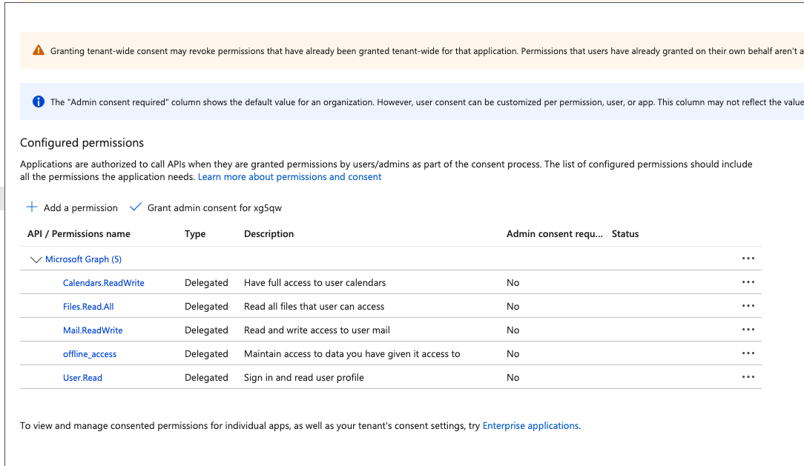
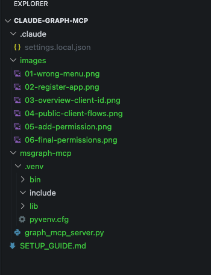
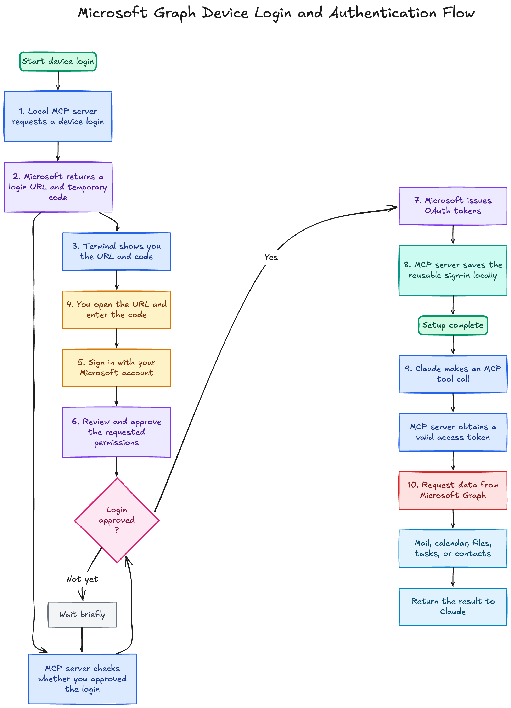
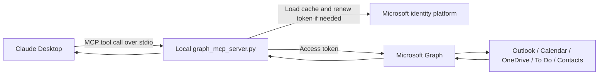

# Connecting Claude Desktop to a personal Outlook or Hotmail account



*Figure 1: Claude Desktop talks to a local MCP server, which uses Microsoft Graph to reach the personal Microsoft account.*

Claude Desktop's built-in Microsoft 365 connector is meant for work and school accounts. If you try to use a personal `@hotmail.com`, `@outlook.com`, or `@live.com` address, the sign-in is rejected.

Microsoft Graph itself can work with personal Microsoft accounts. The workaround is to register your own Microsoft application, allow personal accounts, and let Claude Desktop talk to Graph through a small local MCP server.

This guide covers the setup on macOS.

## What this setup can do

| Capability | Available? |
| --- | --- |
| Read and search mail | Yes |
| Create drafts and draft replies | Yes |
| Send mail | No |
| Navigate mail folders and move messages between them | Yes |
| Flag, categorize, and mark mail read or unread | Yes |
| Create inbox rules that move mail into a folder | Yes |
| Read and create calendar events | Yes |
| Search and read OneDrive files | Yes, read only |
| Manage Microsoft To Do tasks | Yes |
| Search and create contacts | Yes |
| Delete anything (mail, calendar, folders, files, ...) | No |

The server does not request `Mail.Send`, so Claude can prepare a draft but cannot send it. It also does not expose tools that delete messages, events, folders, tasks, contacts, or Drive items. `delete_mail_rule` is the one name that can be confusing: it deletes an inbox rule, not an email.

The setup has three moving parts: the Entra application, the local Python MCP server, and the Claude Desktop configuration that launches it. The first Microsoft sign-in is manual. After that, MSAL normally reuses the cached authentication state.

---

# Part A: Register the application in Microsoft Entra

A paid Azure subscription is not required.

## A1. Open App registrations

Go to **entra.microsoft.com**.

Open **Entra ID** and then **App registrations**.

You can also open the page directly:

```text
https://entra.microsoft.com/#view/Microsoft_AAD_RegisteredApps/ApplicationsListBlade
```

## A2. Create the registration

Select **New registration** and use:

- **Name:** `claude-graph-mcp`
- **Supported account types:** Accounts in any organisational directory and personal Microsoft accounts
- **Redirect URI:** Leave blank

The account type is the setting that matters here. It must include personal Microsoft accounts.



## A3. Copy the client ID

After the registration is created, copy the **Application (client) ID** from the overview page. You will need it for the first login and for the Claude Desktop configuration.

Also check **Supported account types**. It should show:

```text
All Microsoft account users
```

If it does not, recreate the registration with the correct account type.



You may see a warning about consent for newly registered multitenant applications without a verified publisher. If Microsoft later rejects consent, keep the exact error message before changing settings.

## A4. Enable public client flows

Open **Authentication**, then the **Settings** tab.

1. Set **Allow public client flows** to **Enabled**.
2. Select **Save**.

The device-code login used by this server depends on this setting.



## A5. Add Microsoft Graph permissions

Go to:

**API permissions** → **Add a permission** → **Microsoft Graph** → **Delegated permissions**



Add these permissions:

```text
User.Read
Mail.ReadWrite
Calendars.ReadWrite
Files.Read.All
MailboxSettings.ReadWrite
Tasks.ReadWrite
Contacts.ReadWrite
offline_access
```

| Permission | Used for |
| --- | --- |
| `User.Read` | Identify the signed-in Microsoft account |
| `Mail.ReadWrite` | Read mail, create drafts, move mail, flag, categorize, and mark messages read or unread |
| `Calendars.ReadWrite` | Read and create calendar events |
| `Files.Read.All` | Read files from OneDrive |
| `MailboxSettings.ReadWrite` | Create and manage inbox rules |
| `Tasks.ReadWrite` | Read and create Microsoft To Do tasks |
| `Contacts.ReadWrite` | Search and create contacts |
| `offline_access` | Renew access without another interactive sign-in each time |

`User.Read` is often added automatically. `offline_access` may appear under an OpenID-related group, so searching for it by name is easier.

Do not add `Mail.Send`.

The OneDrive permission is `Files.Read.All`, not `Files.ReadWrite.All`. The server described in this guide also has no tool that deletes mail, events, folders, tasks, contacts, or Drive items.

## A6. Check the permission list

The final list should contain the eight delegated permissions above and should not contain `Mail.Send`.



For this personal-account setup, you do not need **Grant admin consent**. Consent happens when you sign in with the personal Microsoft account in Part C.

---

# Part B: Install the MCP server locally

Put `graph_mcp_server.py` in your Downloads folder, then run:

```bash
mkdir -p ~/msgraph-mcp
mv ~/Downloads/graph_mcp_server.py ~/msgraph-mcp/
cd ~/msgraph-mcp
python3 -m venv .venv
source .venv/bin/activate
pip install "mcp[cli]" msal httpx
```

This creates `~/msgraph-mcp`, moves the server into it, creates a virtual environment, and installs the Python packages it needs.



The `images` folder in the screenshot belongs to this guide. The MCP server itself only needs the Python file and its virtual environment.

---

# Part C: Sign in to the personal Microsoft account

Do the first sign-in from Terminal. Claude Desktop's MCP process is not a useful place to complete an interactive device-code login.

From `~/msgraph-mcp`:

```bash
export MSGRAPH_CLIENT_ID="<your client ID from A3>"
python graph_mcp_server.py login
```

The script prints a short-lived code and asks you to open:

```text
https://microsoft.com/devicelogin
```

Enter the code and sign in with the personal Microsoft account whose mailbox you want Claude to use.

The account used here does not have to be the same account that created the Entra application. The Entra account owns the registration. The account used during device login is the mailbox, calendar, OneDrive, To Do, and contacts account the delegated token belongs to.

After you approve the permissions, Terminal should show something similar to:

```text
Authenticated. Token cached at …
```

The script then exits. The default cache is:

```text
~/.msgraph-mcp/token_cache.json
```

Later requests normally use this cached sign-in.

## Why the `login` command is separate

Running:

```bash
python graph_mcp_server.py
```

starts the MCP server and waits for JSON-RPC requests on standard input. It does not immediately start authentication.

The `login` subcommand runs the authentication path directly, shows the device code in a visible terminal, writes the token cache, and exits.

## What happens during device login

The login uses OAuth 2.0 device authorization flow. Your Microsoft password and MFA stay on Microsoft's site; the local server never asks for or stores them.

<!-- Diagram source: images/device-login-flow.mmd -->


A few pieces are worth distinguishing:

| Item | What it identifies or proves | Lifetime | Secret? |
| --- | --- | --- | --- |
| Client ID | Which registered application is asking | Long-lived | No |
| Device code | Which pending terminal login you are approving | Short-lived, one login | Treat as temporary-sensitive |
| Microsoft password/MFA | That you control the Microsoft account | Used only by Microsoft during sign-in | Yes; never seen by this server |
| Access token | That the app currently has approved Graph access | Short-lived | Yes |
| Cached authentication state | Lets MSAL renew access without another interactive login | Until expired, revoked, or removed | Yes |

The client ID is a public application identifier. The displayed device code is temporary. The access token and the cached authentication state are credentials and should be treated as sensitive.

While you are signing in, the server polls Microsoft to see whether the device code has been approved. No browser callback to your computer is needed.

Once login has succeeded, the normal path is shorter:



If the cache is removed, consent is revoked, Microsoft requires a fresh sign-in, or the requested permissions change, run the `login` command again in Terminal.

---

# Part D: Add the server to Claude Desktop

Claude Desktop keeps its local MCP configuration here:

```text
~/Library/Application Support/Claude/claude_desktop_config.json
```

Open it in TextEdit:

```bash
open -e ~/Library/Application\ Support/Claude/claude_desktop_config.json
```

If the path does not exist yet:

```bash
mkdir -p ~/Library/Application\ Support/Claude
touch ~/Library/Application\ Support/Claude/claude_desktop_config.json
open -e ~/Library/Application\ Support/Claude/claude_desktop_config.json
```

## If the file is empty

Replace `YOUR_USERNAME` with your macOS username and use the client ID from Part A.

```json
{
  "mcpServers": {
    "microsoft-graph": {
      "command": "/Users/YOUR_USERNAME/msgraph-mcp/.venv/bin/python",
      "args": [
        "/Users/YOUR_USERNAME/msgraph-mcp/graph_mcp_server.py"
      ],
      "env": {
        "MSGRAPH_CLIENT_ID": "<your client ID from A3>"
      }
    }
  }
}
```

## If you already have other MCP servers

Keep the existing configuration and add `microsoft-graph` inside the current `mcpServers` object:

```json
{
  "mcpServers": {
    "existing-server": {
      "command": "/path/to/existing/server"
    },
    "microsoft-graph": {
      "command": "/Users/YOUR_USERNAME/msgraph-mcp/.venv/bin/python",
      "args": [
        "/Users/YOUR_USERNAME/msgraph-mcp/graph_mcp_server.py"
      ],
      "env": {
        "MSGRAPH_CLIENT_ID": "<your client ID from A3>"
      }
    }
  }
}
```

Use absolute paths. Claude Desktop does not reliably expand `~`, and its process does not inherit your normal Terminal environment in the same way your shell does.

After saving the file, quit Claude Desktop completely with **Cmd-Q**, reopen it, and start a new chat. Closing the window is not enough because the application has to reload the MCP configuration.

---

# Part E: Test the connection

In a new Claude Desktop chat, ask:

```text
Use whoami to check which Microsoft account is connected
```

The `whoami` tool should return the personal Microsoft account used in Part C.

Then try:

```text
Search my mailbox for recent emails from Microsoft
```

At that point the path is:

```text
Claude Desktop
    → local MCP server
    → cached Microsoft sign-in
    → Microsoft Graph
    → your personal mailbox
```

---

# Using more than one personal Microsoft account

You do not need another copy of the project, another virtual environment, or another Entra application for every mailbox. The same Entra application can be used with multiple personal Microsoft accounts.

What must be separate is the token cache.

```text
One Entra application and client ID
                 │
                 ├── MCP server: ms-graph-das-d-hotmail
                 │       └── token_cache.json
                 │               └── das.d@hotmail.com
                 │
                 └── MCP server: ms-graph-dwai-hotmail
                         └── token_cache_dwaipayan.json
                                 └── dwaipayan.das@hotmail.com
```

The client ID identifies the application. The device login selects the Microsoft account. Claude Desktop can launch the same Python server as separate processes, each with its own cache file.

## 1. Choose another cache path

For example:

```text
~/.msgraph-mcp/token_cache.json
~/.msgraph-mcp/token_cache_dwaipayan.json
```

Do not point two account entries at the same cache. This server selects the first account it finds in a cache, so a shared cache makes the target mailbox ambiguous.

## 2. Sign in to the second account

From `~/msgraph-mcp`:

```bash
MSGRAPH_CLIENT_ID="<your client ID from A3>" \
MSGRAPH_TOKEN_CACHE="$HOME/.msgraph-mcp/token_cache_dwaipayan.json" \
.venv/bin/python graph_mcp_server.py login
```

Open the device-login page, enter the code, and choose the additional Microsoft account. If Microsoft keeps selecting an account that is already signed in, a private browser window can make the choice easier.

A successful login should end with something similar to:

```text
Authenticated. Token cached at /Users/YOUR_USERNAME/.msgraph-mcp/token_cache_dwaipayan.json
```

This does not create another Entra application. It stores consent and reusable authentication state for another user of the same public-client application.

## 3. Add one Claude Desktop entry per account

Set `MSGRAPH_TOKEN_CACHE` explicitly for each entry:

```json
{
  "mcpServers": {
    "ms-graph-das-d-hotmail": {
      "command": "/Users/YOUR_USERNAME/msgraph-mcp/.venv/bin/python",
      "args": [
        "/Users/YOUR_USERNAME/msgraph-mcp/graph_mcp_server.py"
      ],
      "env": {
        "MSGRAPH_CLIENT_ID": "<your client ID from A3>",
        "MSGRAPH_TOKEN_CACHE": "/Users/YOUR_USERNAME/.msgraph-mcp/token_cache.json"
      }
    },
    "ms-graph-dwai-hotmail": {
      "command": "/Users/YOUR_USERNAME/msgraph-mcp/.venv/bin/python",
      "args": [
        "/Users/YOUR_USERNAME/msgraph-mcp/graph_mcp_server.py"
      ],
      "env": {
        "MSGRAPH_CLIENT_ID": "<the same client ID from A3>",
        "MSGRAPH_TOKEN_CACHE": "/Users/YOUR_USERNAME/.msgraph-mcp/token_cache_dwaipayan.json"
      }
    }
  }
}
```

Keep any other MCP servers and top-level Claude Desktop settings already in the file. Then quit Claude Desktop with **Cmd-Q** and reopen it.

## 4. Check both accounts

Call `whoami` through each named server before doing mailbox or calendar work.

```text
Use ms-graph-das-d-hotmail to search for recent bank messages.
Use ms-graph-dwai-hotmail to show tomorrow's calendar.
Compare unread messages across both Microsoft accounts.
```

For another account, repeat the same pattern: create a new cache file, complete one device login, and add another uniquely named MCP entry.

---

# If you change the requested permissions

If you add scopes later, the old cache may not contain consent for them. Delete the cache and sign in again:

```bash
rm ~/.msgraph-mcp/token_cache.json
export MSGRAPH_CLIENT_ID="<your client ID from A3>"
python graph_mcp_server.py login
```

Approve the new permissions when Microsoft prompts you. Until then, a tool that needs a newly added scope can fail even while older tools such as `search_mail` continue to work.

---

# Tools exposed by this server

| Tool | What it does |
| --- | --- |
| `whoami` | Shows which Microsoft account is connected |
| `search_mail` | Searches across the mailbox |
| `list_recent_mail` | Lists recent messages from folders such as inbox, sent items, or drafts |
| `read_message` | Reads the full body of a message |
| `create_draft` | Creates an email draft |
| `reply_draft` | Creates a draft reply to an existing message |
| `list_mail_folders` | Returns the mail folder tree from a given folder or the top level |
| `resolve_folder_path` | Resolves a path such as `Inbox/Bank/CIBC_Canada` to a folder ID |
| `list_messages_in_folder` | Lists recent messages in a folder found by path |
| `create_mail_folder` | Creates a mail folder at a given path or returns it if it already exists |
| `move_message` | Moves a message to another folder |
| `flag_message` | Sets or clears the follow-up flag on a message |
| `categorize_message` | Sets category labels on a message |
| `mark_message_read` | Marks a message read or unread |
| `list_mail_rules` | Lists inbox rules |
| `create_mail_rule` | Creates an inbox rule that moves matching mail into a folder |
| `delete_mail_rule` | Deletes an inbox rule, not an email |
| `list_events` | Lists calendar events within a date range |
| `create_event` | Creates a calendar event |
| `search_onedrive` | Searches OneDrive files |
| `list_onedrive_folder` | Lists the contents of a OneDrive folder |
| `read_onedrive_file` | Reads the contents of a text-based OneDrive file |
| `list_task_lists` | Lists Microsoft To Do task lists |
| `list_tasks` | Lists tasks in a To Do list |
| `create_task` | Creates a task in a To Do list |
| `complete_task` | Marks a task completed |
| `search_contacts` | Searches contacts by name or email address |
| `create_contact` | Creates a contact |

The implementation in `graph_mcp_server.py` determines the exact tool behaviour. The Graph permissions from Part A set the upper limit on what the server can access.

---

# How the pieces fit together

The Entra registration identifies the local application to Microsoft Graph and defines the delegated permissions it may request.

Because this is a local desktop script, it is configured as a public client. There is no client secret to hide on the machine.

The server uses MSAL for authentication. It reads the cached account state from:

```text
~/.msgraph-mcp/token_cache.json
```

When Claude calls a tool such as `search_mail`, Claude Desktop sends a JSON-RPC request to the local FastMCP process. The server asks MSAL for a valid access token, renews it from the cache when possible, calls Microsoft Graph, and returns the result to Claude.

```text
Claude Desktop
    ↕ stdio JSON-RPC
graph_mcp_server.py
    ↕ MSAL authentication
Microsoft Graph API
    ↕
Outlook, Calendar, OneDrive, To Do, or Contacts
```

Claude Desktop does not call Graph directly. The local MCP server sits in the middle.

---

# Troubleshooting

## Start with the Claude Desktop logs

Claude Desktop normally writes MCP logs under:

```text
~/Library/Logs/Claude/
```

The main files for this setup are:

| Log file | Use it for |
| --- | --- |
| `mcp-server-microsoft-graph.log` | This server's launch, MCP requests and responses, stderr, Graph request status, login messages, shutdowns, and timeouts |
| `mcp.log` | MCP lifecycle messages across configured servers |
| `main.log` | General Claude Desktop and configuration errors |

List the files:

```bash
ls -la ~/Library/Logs/Claude
```

Read the latest server entries:

```bash
tail -n 100 ~/Library/Logs/Claude/mcp-server-microsoft-graph.log
```

Search for useful events:

```bash
rg -n "Initializing|Server started|tools/call|To sign in|HTTP Request|error|cancelled|Shutting down" \
  ~/Library/Logs/Claude/mcp-server-microsoft-graph.log
```

Or follow the log while reproducing the problem:

```bash
tail -f ~/Library/Logs/Claude/mcp-server-microsoft-graph.log
```

Press `Ctrl-C` when finished.

The server writes diagnostics to stderr because stdout is reserved for MCP JSON-RPC. Claude captures that stderr in the server-specific log.

Review a log before sharing it. It can contain filesystem paths, account details, email metadata, Graph errors, and short-lived device-login codes. Never share the token cache.

## Quick checks

First confirm that the configured Python and server paths exist:

```bash
ls -l /absolute/path/to/msgraph-mcp/.venv/bin/python
ls -l /absolute/path/to/msgraph-mcp/graph_mcp_server.py
```

Then validate the Claude configuration:

```bash
python3 -m json.tool \
  ~/Library/Application\ Support/Claude/claude_desktop_config.json >/dev/null \
  && echo "Claude configuration is valid JSON"
```

A healthy startup should show `Server started and connected successfully`, followed by `initialize` and `tools/list` messages in the MCP log.

If authentication is required, run login from a visible Terminal:

```bash
export MSGRAPH_CLIENT_ID="<your client ID>"
/absolute/path/to/msgraph-mcp/.venv/bin/python \
  /absolute/path/to/msgraph-mcp/graph_mcp_server.py login
```

Then quit Claude Desktop with **Cmd-Q**, reopen it, and test:

```text
Use microsoft-graph whoami to check which Microsoft account is connected
```

Normal MCP tool calls should fail quickly with an authentication message when no usable cache is available. They should not leave Claude waiting for an invisible device-login flow.

## Common log signatures

| Log message or behaviour | Meaning | What to do |
| --- | --- | --- |
| `ENOENT`, `spawn ... failed`, or a configured path does not exist | Claude is using a stale Python or server path | Fix `command` and `args` with absolute existing paths, then restart Claude |
| `MSGRAPH_CLIENT_ID is not set` | The server's `env` block is missing the client ID | Add `MSGRAPH_CLIENT_ID` |
| `Microsoft authentication is required` | No usable cached token is available | Run the explicit `login` command |
| `To sign in ... enter the code ...` during `login` | Device login is waiting for browser approval | Open Microsoft's login page and enter the code |
| HTTP `401 Unauthorized` | The token is expired, revoked, invalid, or for the wrong registration | Run login again; remove the cache first if necessary |
| HTTP `403 Forbidden` | The account or application lacks the requested permission | Check delegated Graph permissions and re-consent after changing scopes |
| A retry suddenly works after an earlier timeout | A new process loaded authentication that the old process did not have | Restart Claude if it is still running older server code |
| `Server started and connected successfully`, but there is no `tools/call` | Claude started the server but did not invoke the requested tool | Name `microsoft-graph` and the tool, for example `whoami`, explicitly |

## Device-code login does not start

Check **Authentication** → **Allow public client flows** in the Entra application. It must be enabled and saved.

## `whoami` shows the wrong account

Remove the cache and log in again with the intended mailbox:

```bash
rm ~/.msgraph-mcp/token_cache.json
export MSGRAPH_CLIENT_ID="<your client ID>"
python graph_mcp_server.py login
```

## The MCP server does not appear in Claude Desktop

Check that:

- the Python path in `claude_desktop_config.json` is absolute;
- the path to `graph_mcp_server.py` is absolute;
- the virtual environment exists;
- the JSON is valid;
- Claude Desktop was fully quit with **Cmd-Q** before reopening.

You can test the configured executable directly:

```bash
/Users/YOUR_USERNAME/msgraph-mcp/.venv/bin/python \
/Users/YOUR_USERNAME/msgraph-mcp/graph_mcp_server.py
```

If it starts and waits without an error, the paths are probably correct. Press `Ctrl-C` to stop it.

## Microsoft shows a consent error

Keep the exact error message and check:

- the application supports personal Microsoft accounts;
- public client flows are enabled;
- the correct client ID is being used;
- the intended personal account is being used for login;
- the requested permissions match Part A.

Change one thing at a time. The Microsoft error is usually more useful than guessing at several settings at once.

## What about app passwords or basic IMAP?

This setup does not use them. Authentication is OAuth through Microsoft Graph. The server does not store your Outlook password and does not use basic authentication against `imap-mail.outlook.com`.

---

# Security notes

The sensitive local file is the token cache:

```text
~/.msgraph-mcp/token_cache.json
```

Do not upload it to GitHub, attach it to support tickets, or put it in a shared folder.

For the project directory, add:

```gitignore
.venv/
token_cache.json
__pycache__/
*.pyc
```

If you no longer want the MCP server to use the account, delete the token cache, remove the application's consent from your Microsoft account security settings, and remove the server entry from:

```text
~/Library/Application Support/Claude/claude_desktop_config.json
```
